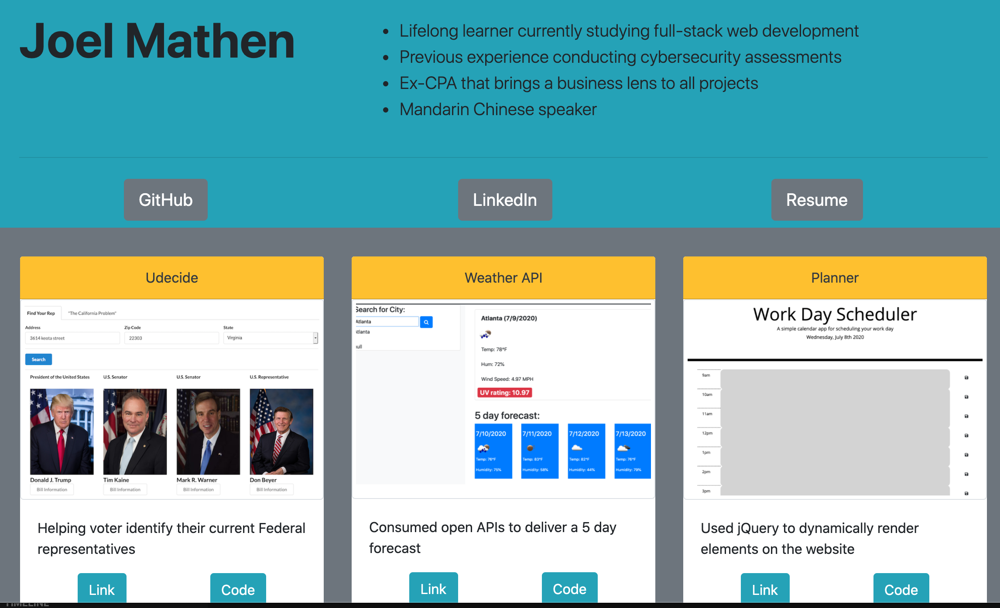

# Portfolio Hightlights
I design a porfolio to highlight key projects that I have completed to showcase growing software developer skills

## Technologies Used
I used Bootstrap for the front-end design and linked contact information to my GitHub repos and deployed links. I also have deployed a resume as a PDF. 

### Link to deployed World Quiz game
[Portfolio](https://crackedsnowboard.github.io/portfolio-highlights/)

#### Image of deployed web applicaton

    